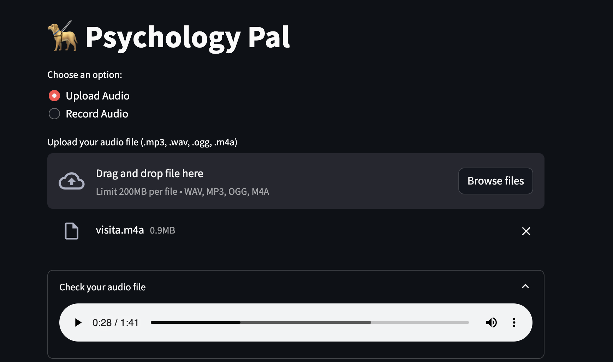
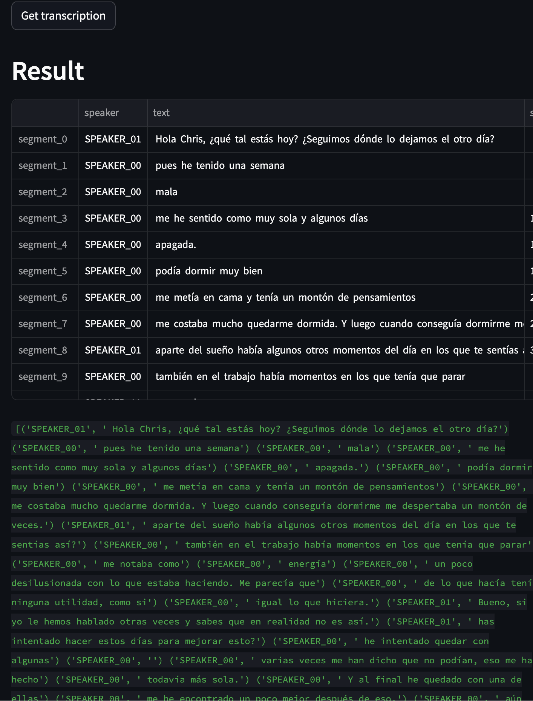
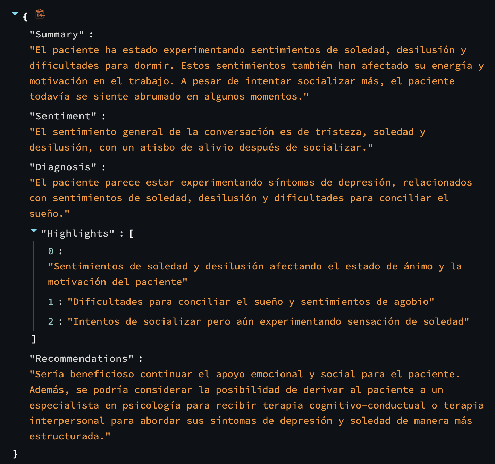

# Psychology Pal
Your app to help you take patient consultations powered by AI!

## Description
An AI assistant that supports in sessions with patients. Among others it will do:
- Speaker identification (diarization)
- Transcription
- Summarization
- Recommend action

Handles different languages with ease, examples below in spanish for instance.  
All visualized in a streamlit app  
This showcase is based on a Psychology assistant, but it could be applied to any medical field.


## Requirements
To run whisper you will need ffmpeg. Follow [instructions](https://pypi.org/project/openai-whisper/)  
Speaker Diarization based on my other repo [Whisper-Pyannote](https://github.com/Jose-Sabater/whisper-pyannote)

## Usage
```
pip install -r requirements.txt
streamlit run app.py
```
Accepts file upload or recording on the app
  
Transcription and diarization details:

Finally LLM results, in the language of the conversation.



## License
MIT

